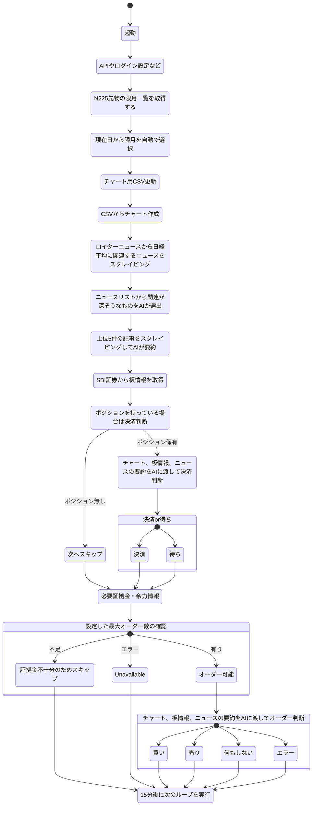

```mermaid
stateDiagram
    [*] --> 起動
    起動 --> APIやログイン設定など
    APIやログイン設定など --> N225先物の限月一覧を取得する  
    N225先物の限月一覧を取得する   --> 現在日から限月を自動で選択
    現在日から限月を自動で選択 --> チャート用CSV更新
    チャート用CSV更新 --> CSVからチャート作成
    CSVからチャート作成 --> ロイターニュースから日経平均に関連するニュースをスクレイピング
    ロイターニュースから日経平均に関連するニュースをスクレイピング --> ニュースリストから関連が深そうなものをAIが選出
    ニュースリストから関連が深そうなものをAIが選出 --> 上位5件の記事をスクレイピングしてAIが要約
    上位5件の記事をスクレイピングしてAIが要約 --> SBI証券から板情報を取得
    SBI証券から板情報を取得 --> ポジションを持っている場合は決済判断
    ポジションを持っている場合は決済判断 --> 次へスキップ: ポジション無し
    ポジションを持っている場合は決済判断 --> チャート、板情報、ニュースの要約をAIに渡して決済判断: ポジション保有
    チャート、板情報、ニュースの要約をAIに渡して決済判断 --> 決済or待ち
    state 決済or待ち {
        [*] --> 決済
        [*] --> 待ち
    }
    次へスキップ --> 必要証拠金・余力情報
    決済 --> 必要証拠金・余力情報
    待ち --> 必要証拠金・余力情報
    必要証拠金・余力情報 --> 設定した最大オーダー数の確認
    state 設定した最大オーダー数の確認 {
        [*] --> 証拠金不十分のためスキップ: 不足
        [*] --> Unavailable: エラー
        [*] --> オーダー可能: 有り
    }
    オーダー可能 --> チャート、板情報、ニュースの要約をAIに渡してオーダー判断
    state チャート、板情報、ニュースの要約をAIに渡してオーダー判断 {
        [*] --> 買い
        [*] --> 売り
        [*] --> 何もしない
        [*] --> エラー
    }

    証拠金不十分のためスキップ --> 15分後に次のループを実行
    Unavailable --> 15分後に次のループを実行
    買い --> 15分後に次のループを実行
    売り --> 15分後に次のループを実行
    何もしない --> 15分後に次のループを実行
    エラー --> 15分後に次のループを実行
```